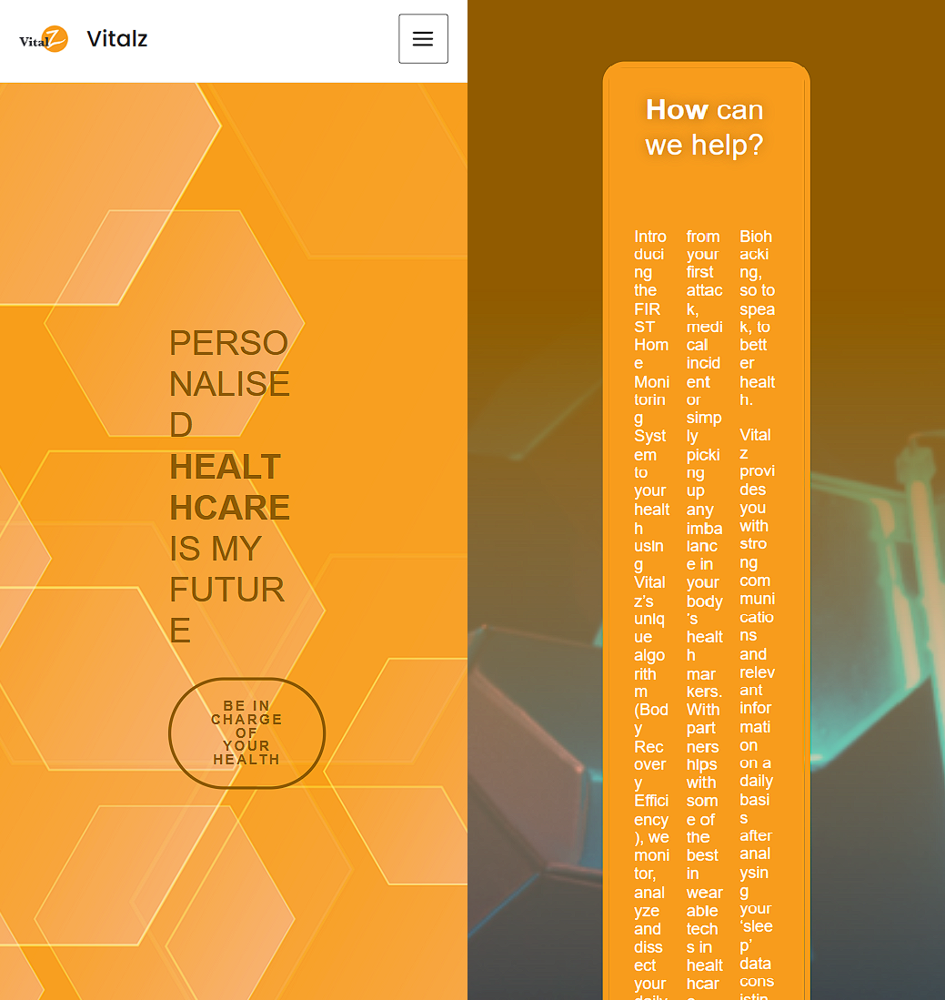

# Vitalz Project
## Showcase

<image src = "./assets/mobile.gif" height="500"/>

<image src = "./assets/desktop.gif" height="300"/>

## How to run
1. pull this repo
2. go to vitalz folder and run `npm install` to install all the packages
3. run `npm run dev` in the command line.
4. go to http://localhost:3000/ 

## Purpose
1. A small web application that allows users to select a user from a list and view their daily statistics.
2. Use the provided sample data to present the information effectively.
3. Using tools like Next.js and Bootstrap to create visually appealing and intuitive interfaces
4. Design should not only be effective but also engaging.
5. User journey, anticipate their needs, and strive to create an interface that seamlessly guides them through the application.

The company website: https://vitalz.asia/

<image src = "./assets/image.png" height="500"/>

## Thoughts and Keypoint
1. After looking through the company website, notice several things can be better and got some idea from the original theme.
2. Firstly the original website is nice and simple, **but** it's **not fully responsive** such as pages below.

3. Other than that, the original website **lack of animation**, which will decrease the interactivity of the website, thus making it not so interesting while browsing.
4. But browsing through i've copy the color theme of the original website, replacing color of a brand is not a good idea, other than that, orange still makes a good color for medical company as it gives mood of **positive**.
5. What i get from the purpose is to make a dashboard to let user/admin check their health status that are collected from a device called (U.S Biostrap).

## Design
1. Typography - i've choosen the beautiful **sans-serif** -  **Futura** font, the reason behind it is because it's easily **readable**, give a sense of **trustable**, and it's **modern**
<image src = "./assets/image-1.png" height="300"/>
3. Colors - as stated as before, the primary color remain the <span style="color:#F8A129;">same</span>, but for secondary, accent, black etc i've choosen others to be harmonious.
<image src = "./assets/image-2.png" height="300"/>
5. High-fidelity design
<image src = "./assets/image-4.png" height="500"/>

In this **framer** design, i've used a lot of rounded corner element to mimic the feeling of modern phone application. Also there is **three version of design** including (computer 1080px, tablet 768px and phone 320px) which are mostly enough for current situation.

As you can see in the design, instead of rendering all user data at the same time, i've choosen the approach to let user to choose a date to show the data, this will make the page less crowded and interactive!

For mobile version of choosing stats to view, i've designed a selector to let user switch between **sleep data** and **user analysis**.
<image src = "./assets/selector.gif" height="500"/>


## Some modification
### monthDivider.js
Since the api return data that is not to friendly to render, i've coded a function to convert these original JSON structure into more structured to fit my design.

A js module to convert api get from into year and month structured data (sorted from latest to oldest).

example:
**input:**
```json
[
    {
        "HRVDate": "2024-04-18",
        "SleepOnset": "2024-04-17T15:31:01.000Z",
        "WakeUpTime": "2024-04-17T22:21:02.000Z",
        "Awake": "28",
        "Light": "47",
        "Deep": "25"
    },
    {
        "HRVDate": "2024-05-28",
        "SleepOnset": "2024-05-27T15:34:04.000Z",
        "WakeUpTime": "2024-05-27T23:30:01.000Z",
        "Awake": "24",
        "Light": "49",
        "Deep": "28"
    },
    {
        "HRVDate": "2024-06-14",
        "SleepOnset": "2024-06-13T17:12:01.000Z",
        "WakeUpTime": "2024-06-13T23:43:03.000Z",
        "Awake": "20",
        "Light": "53",
        "Deep": "27"
    },
    {
        "HRVDate": "2024-04-04",
        "SleepOnset": "2024-04-03T14:16:01.000Z",
        "WakeUpTime": "2024-04-03T22:10:00.000Z",
        "Awake": "25",
        "Light": "44",
        "Deep": "31"
    }
]
```

**output:**
```json
{
    "2024": {
        "06": {
            "14": {
                "HRVDate": "2024-06-14",
                "SleepOnset": "2024-06-13T17:12:01.000Z",
                "WakeUpTime": "2024-06-13T23:43:03.000Z",
                "Awake": "20",
                "Light": "53",
                "Deep": "27"
            }
        },
        "05": {
            "28": {
                "HRVDate": "2024-05-28",
                "SleepOnset": "2024-05-27T15:34:04.000Z",
                "WakeUpTime": "2024-05-27T23:30:01.000Z",
                "Awake": "24",
                "Light": "49",
                "Deep": "28"
            }
        },
        "04": {
            "4": {
                "HRVDate": "2024-04-04",
                "SleepOnset": "2024-04-03T14:16:01.000Z",
                "WakeUpTime": "2024-04-03T22:10:00.000Z",
                "Awake": "25",
                "Light": "44",
                "Deep": "31"
            },
            "18": {
                "HRVDate": "2024-04-18",
                "SleepOnset": "2024-04-17T15:31:01.000Z",
                "WakeUpTime": "2024-04-17T22:21:02.000Z",
                "Awake": "28",
                "Light": "47",
                "Deep": "25"
            }
        }
    }
}

```

## Some important notes
There is some problem while connecting to api, i've downloaded all the data from it.
It will be no problem even change to fetching api.

## Project Timeline
2024/7/8 till 2024/7/9
Learn design principle (layout, typography and colors)
Design high fidelity mockups

2024/7/9
Learn React framework

2024/7/10 till 2024/7/11
Develop using React, Tailwind, GSAP and SplitText

---
Built and designed by AngusTan 2024.
